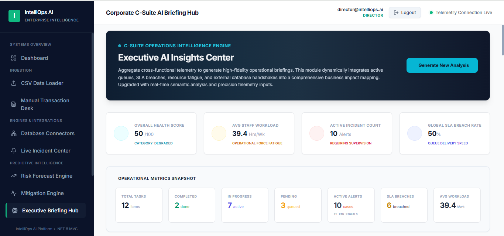
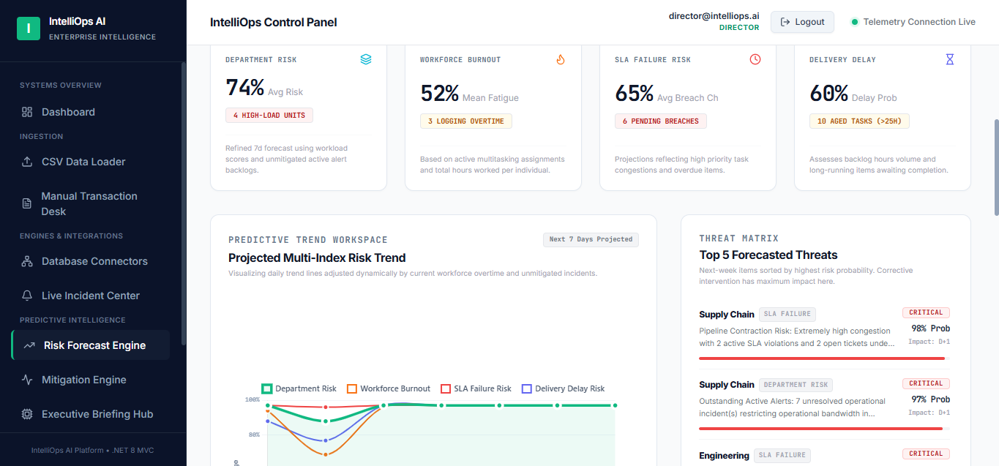
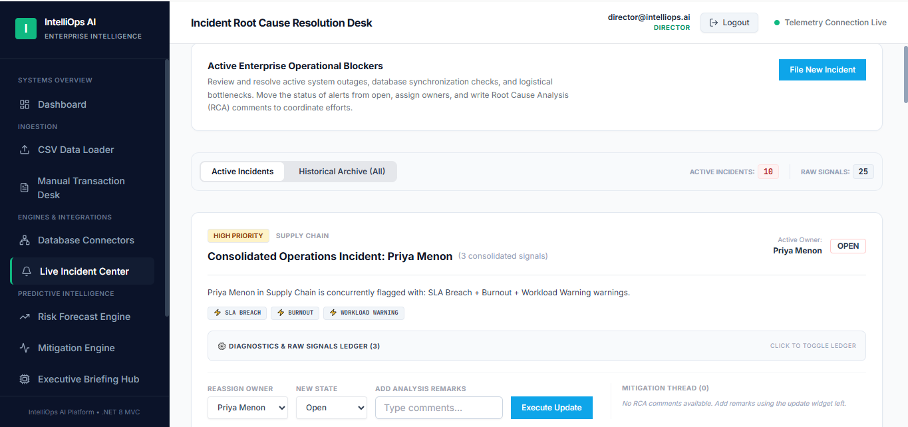
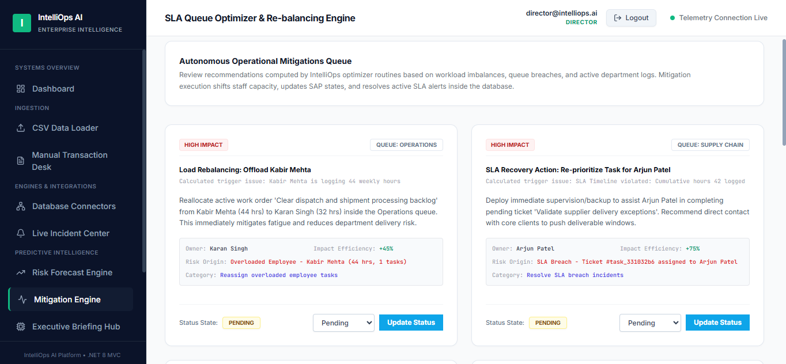
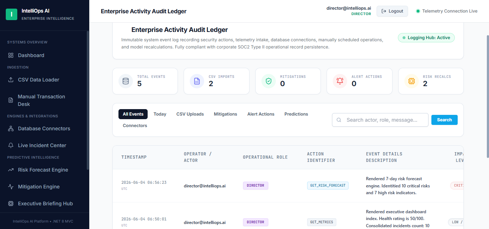

# IntelliOps AI

Enterprise Operations Intelligence Platform built using ASP.NET Core MVC, Entity Framework Core, SQL Server, and AI-driven operational analytics.

🌐 Live Demo: https://intelliopsai.onrender.com/

---

## Overview

IntelliOps AI is an enterprise operations intelligence platform designed to help organizations monitor operational health, identify risks, manage incidents, forecast delivery issues, and generate executive-level AI insights from operational data.

The platform simulates a real-world enterprise environment by combining operational workflows, incident management, predictive analytics, SAP-style integrations, audit logging, and executive reporting into a single unified dashboard.

---

## Key Features

### Executive AI Briefing Hub
- AI-generated executive operational summaries
- Critical incident analysis
- Business impact assessment
- AI-recommended actions
- 24-hour action planning

### Predictive Risk Forecast Engine
- Department risk forecasting
- SLA breach prediction
- Workforce burnout analysis
- Delivery delay forecasting
- Threat matrix generation

### Live Incident Center
- Incident management system
- Consolidated operational alerts
- RCA tracking
- Status monitoring
- Incident ownership assignment

### Mitigation Engine
- AI-generated mitigation recommendations
- Workload rebalancing suggestions
- SLA recovery planning
- Operational optimization actions

### Database Connectors
- SAP ERP connector simulation
- Warehouse synchronization monitoring
- Connector health tracking
- Enterprise integration dashboard

### Audit Ledger
- Complete activity tracking
- AI event logging
- Forecast execution records
- Operational compliance monitoring

### CSV Analytics Pipeline
- Bulk operational data ingestion
- Validation and processing logs
- Automated analytics generation

### Manual Transaction Desk
- Schedule operational work orders
- Log incidents manually
- Operational task management

---

## Technology Stack

- ASP.NET Core MVC (.NET 8)
- C#
- Entity Framework Core
- SQL Server
- Razor Views
- Bootstrap
- Chart.js
- ASP.NET Identity
- Gemini AI Integration
- Render Cloud Deployment

---

## System Architecture

Operational Data Sources
↓
CSV Ingestion + Manual Entry
↓
Operational Database
↓
Analytics Engine
↓
Risk Forecast Engine
↓
Incident Consolidation
↓
Executive AI Briefing Hub

---

## Screenshots

### Executive Briefing Hub

---

### Predictive Risk Forecast Engine

---

### Live Incident Center

---

### Mitigation Engine

---

### Audit Ledger

---

## Internship Project Journey

This project was developed during my internship at Surtel Technologies.

### Week 1
- Learned C# and ASP.NET Core MVC
- Studied enterprise software architecture
- Explored internal business workflows

### Week 2
- Developed an Office Supply Tracker application
- Worked with CRUD operations, database integration, and MVC architecture

### Week 3
- Identified a gap in operational intelligence and executive visibility
- Designed IntelliOps AI as an enterprise intelligence layer
- Planned predictive analytics and incident management modules

### Week 4
- Built AI briefing systems
- Developed forecasting and mitigation engines
- Implemented audit logging and SAP-style integration modules
- Deployed application to the cloud

---

## Business Impact

IntelliOps AI helps organizations:

- Detect operational risks early
- Forecast SLA failures
- Monitor workforce fatigue
- Track enterprise incidents
- Generate executive-level operational reports
- Improve decision-making through AI-driven insights

---

## Future Enhancements

- Real SAP integration
- Role-based dashboards
- Multi-tenant architecture
- Real-time notifications
- Advanced AI recommendations
- Enterprise authentication providers

---

## Author

**Parina Jain**

B.Tech Computer Science Engineering  
KIIT University

GitHub: https://github.com/Parinajain15

LinkedIn: https://www.linkedin.com/in/parinajain15/

---

⭐ If you found this project interesting, consider starring the repository.
